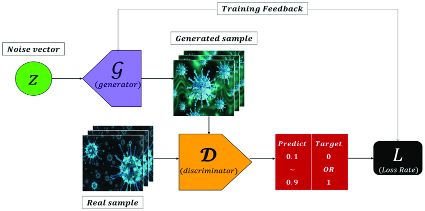

문서 제목(큰제목)
===

문서 부제목(작은 제목)
---

포스터의 작성은 반드시 'YYYY-MM-DD-[포스트이름].md' 라는 파일명으로 작성해야 다

# 글머리 크기 H1
## 글머리 크기 H2
### 글머리 크기 H3
#### 글머리 크기 H4
##### 글머리 크기 H5
###### 글머리 크기 H6   
3칸 이상 띄어쓰기 -> 줄바꿈   
3칸 이상 띄어쓰기     
줄바꿈됨
단순 엔터로는 줄바꿈 안됨   

블럭 인용문자는 무엇인가요?
> 화살표를 넣으면 됩니다
> > 두개 넣으니 두줄되네요

1. 목록
2. 목록2
3. 목록3

순서없는 목록을 만들어보자
* 대순서
  * 중순서(탭 누르면 순서가 아래로 내려가는듯)
    * 소 순서
  * 탭 누른거에서 백스페이스 하면 순위 올라감   

순서 목록은 *, +, - 세가지가 가능하다

코드 입력은 4개의 공백 혹은 하나의 탭   
코드입력 시작:(한줄 띄워쓴 뒤 탭 임)

    print("hello python")
코드 입력 끝

* 코드 블럭 코드도 있음(어느 언어인지 지정가능)

```python
from psutil import virtual_memory
#psutil은 파이썬을 위한 실행중인 프로세스 및 시스템 리소스
#그리고 정보 검색을 위한 크로스 플랫폼 라이브러임
import torch
```

인라인코드 : `를 사용하면 됨   

* `ctrl` + `spacebar`를 사용하면 vscode의 마크다운   
자동완성 기능을 사용할 수 있다.

링크 입력하기    

[vscode markdown 앱 설명 링크](https://marketplace.visualstudio.com/items?itemName=yzhang.markdown-all-in-one#table-of-contents)




이미지 사이즈 조절은 html포맷이 대다수인듯..   

   


## 테디노트에서 제공하는 [.ipynb to 깃블로그용.md](http://teddynote.herokuapp.com/convert)파일 변환해주는 사이트