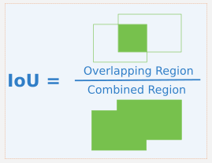
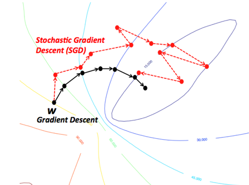

RCNN 논문리뷰
===


Rich feature hierarchies for accurate object detection and semantic segmentation Tech report (v5)


abstract
---
객체 감지 성능에 있어, `PASCAL VOC`데이터 세트를 활용해 측정한 성능은 몇년간 정체상태였으며, 가장 성능이 좋은 방법은 여러 하위 이미지 feature와 상위레벨의 context를 결합하는 앙상블 시스템을 구성하는 것이다.   
본 논문은 mean average precision(mAP) 측정 지표에 있어 VOC 2012 결과값 대비 30%이상 개선된(mAP가 53.3%로 측정됨) 탐지 알고리즘을 제안한다.   
논문의 접근방식은 아래와 같다.   
1. obj를 segment하고 localize하기 바텀-업 방식의 제안영역에 높은 용량을 갖는 CNNs을 적용할 수 있다
2. 훈련을 위한 데이터가 라벨링이 덜 됬을 때, 사전 지도학습(supervised pre-training)을 보조작업으로 도메인별 파인튜닝을 수행해 성능 향상을 가져올 수 있다.


논문은 이 방법을 R-CNN : Regions with CNN이라 부르려 한다  
제안한 RCNN을 ILSVERC2013에서 발표된 OverFeat랑 비교해보니 성능이 더 좋앗다.
      


introduction
---

기존 시각 인식 작업(visual recognition task)는 지난 10년간 SIFT, HOG사용을 기반으로 하고 있다.
그러나, PASCAL VOC Obj detection성능을 보면 일반적으로 10~12년 동안 앙상블 시스템 구축 프로세스를 기반으로 진행되어왔고 해당 방식으로 조금씩의 진보가 이뤄지고 있었다.   

* SIFT(Scale Invariant Feature Transform)
  * 이미지에서 특징점을 추출하는 대표적 알고리즘 중 하나임.   
이미지의 Scale, Rotation에 불변하는 feature(특징)을 찾아냄.

```python
import numpy as np
import cv2
from matplot import pyplot as plt

img1 = cv2.imread('falsify_img.jpg') #변조된 이미지
img2 = cv2.imread('orign_img.jpg') #원본 이미지

sift = cv2.xfeature2d.SIFT_create()
#SIFT 추출기 생성

kp1, des1 = sift.detectAndCompute(img1, None)
#키 포인트 검출과 서술자 계산 -> 이미지 1에 대한
kp2, des2 = sift.detectAndCompute(img2, None)

bf = cv2.BFMacher(cv2.NORM_HAMMING, crossCheck=Ture)
#매칭을 위한 변수 만들고 초기화

matches = bf.match(des1, des2) #매칭 시작
matches = sorted(matches, key = lambda x:x.distance)
#매칭된 특징점들을 길이별로 정렬함

img3 = cv2.drawMatches(img1, kp1, img2, kp2, matches[:10], flags=2)
#이미지1, 이미지2의 매칭결과를 키 포인트와 함께 새로 그림을 그려서 보여줌
plt.imshow(img3)
plt.show()
```
대략 아래와 같은 그림이 그려질 것임


* HOG(Histograms of oriented gradient)
  * 사전 지식으로 edge 검출부터 알아야함   
우선 edge검출의 경우 픽셀의 변화량이 큰 지점을 엣지라 볼 수 있음   
여기서 Histogram of gradient는 이 픽셀의 변화량을 화살표로 표시하여,
화실표를 히스토그램 형태의 feature를 추출하는 방법을 말함


  * 이때 화살표를 그리는 방식에 Gradient orientation(화살표 방향), Gradient magnitude(화살표 크기) 두가지 정보를 만들어 낼 수 있음    
이 두가지 정보를 이용해서 HoG를 구하고 이거로 경계면을 추출해 사람이나 차선등을 구분할 수 있음


  * 사전 지식으로 pixels, cells, blocks, windows의 개념에 대해 알아야 한다.   
픽셀(pixels) : 말 그대로 영상 내 하나의 픽셀 값   
셀(Cells) : 픽셀을 몇개 묶어서 그룹화 한 것   
block : 셀을 묶어서 그룹화 한 것   
window : 검출하고자 잘라낸 영역(블록보다는 크다)   

  * 그렇다면 HOG는 보행자 검출을 위해 만들어진 특징 디스크립터라 볼 수 있으며, 이것에 대한 방식으로 기울기 벡터 크기(magnitude)와 방향(direction)을 히스토그램으로 나타내 계산한 것이다.

```python
img = cv2.imread('img.png')
img = np.float(img)

gx = cv2.Sobel(img, cv2.CV_32F, 1, 0)
gy = cv2.Sobel(img, cv2.CV_32F, 0, 1)
#소벨필터를 활용해 32float 데이터 타입으로 x방향, y방향으로 각각 1차미분
magnitude, angle = cv2.cartToPolar(gx, gy)
#앞에서 편미분 결과 gx, gy를 극좌표로 전환 -> 방향벡터의 크기 및 방향 추출
```
위 계산 후 정규화(normalization)과정을 수행하여 윈도에 대한 히스토그램 특징이 계산된다면 이것과 유사한 정규화 값을 결과값은 검출하고자 하는 대상이라 볼 수있다.   
이것을 OpenCV에서는 HOG 디스크립터 계산을 위한 함수를 따로이 제공한다.   


```python
import cv2

#default 디텍터를 위한 HOG 객체 생성 및 설정
hogdef = cv2.HOGDescriptor()
hogdef.setSVMDetector(cv2.HOGDescriptor_getDefaultPeopleDetector())

#dailer 디텍터를 위한 HOG 객체 생성 및 설정
hogdaim = cv2.HOGDescriptor((48, 96), (16, 16), (8,8), (8,8), 9)
#파라미터 : 윈도 크기, 블록 크기, 정규화 블록 겹침 크기, 셀 크기, 히스토그램 계급 수
hogdaim.setSVMDetector(cv2.HOGDescriptor_getDaimlerPeopleDetector())

cap = cv2.VideoCapture('../img/walking.avi')
mode = True #모드 변환을 위한 플래그 변수
while cap.isOpened():
    ret, img = cap.read()
    if ret :
        if mode:
            # default 디텍터로 보행자 검출
            found, _ = hogdef.detectMultiScale(img)
            for (x,y,w,h) in found:
                cv2.rectangle(img, (x,y), (x+w, y+h), (0,255,255))
        else:
            # daimler 디텍터로 보행자 검출
            found, _ = hogdaim.detectMultiScale(img)
            for (x,y,w,h) in found:
                cv2.rectangle(img, (x,y), (x+w, y+h), (0,255,0))
        cv2.putText(img, 'Detector:%s'%('Default' if mode else 'Daimler'), \
                        (10,50 ), cv2.FONT_HERSHEY_DUPLEX,1, (0,255,0),1)
        cv2.imshow('frame', img)
        key = cv2.waitKey(1) 
        if key == 27:
            break
        elif key == ord(' '):
            mode = not mode
    else:
        break
cap.release()
cv2.destroyAllWindows()
```

여기까지가 SIFT, HOG설명이다....
RCNN 논문에서는 SIFT와 HOG가 영장류의 시각경로의 첫번째 피질 영역인 V1세포의 기능과 연관시킬수 있다는 블록별 방향 히스토그램이라 설명하고 있는데... 흠...   

여기서 neocognitron패턴인식 프로세스가 등장(해당 프로세스는 supervised training algorithm이 부재)   
다음으로 합성곱 신경망(convolutional neural network, CNNs)순으로 발전이 이뤄졌다 이야기를 전개하고 있음   

CNN은 1990년도에 처음등장 -> 벡터머신 등장으로 사장되었으나, 12년 Krizhevsky et al.이 ImageNet Large Scale Visual Recognition Challenge(ILSVRC)에서 훨씬 높은 이미지 분류 정확도를 보여주며 다시 관심이 높아짐  
ImageNet의 CNN classification결과가 PASCAL VOC Challenage(파스칼 VOC 챌린지 대회)에서도 적용이 가능할까??

이 논문에서는 그림1과 같이 CNN을 simpler HOG-like와 같이 사용해서 더 높은 객체 감지 성능을 이끌어 낼 수 있을것이라 제안함???(번역이 어려움..)   
아무튼 비교대상은 2010년에 발표된 Pascal VOC대비 자신들이 제안하는 R-CNN의 성능이 더 높다는 것임


+ R-CNN동작 개요는 (1)입력 이미지를, (2)2000개의 bottom-up 영역을 추출한 뒤, (3)CNN을 통해 feature를 추출한 다음, (4)
classification과정을 통해 영역별로 객체인식을 진행함   
R-CNN의 mean average precision(mAP)는 53.7%가 나왔음

이미지 분류(classification)와 다르게 이미지 detection(감지)는 검출하고자 하는 객체(object)에 대해 localizing을 수행해야 한다.   
이것에 대한 접근 방식(localization을 수행하기 위한 접근방식)은 regression problem이다.   
+ 회귀분석 : 인과관계를 파악하기 위한 분석방법   


이 로컬라이제이션 방식으로 잘 알려진 것은 슬라이딩 윈도우 검출기를 만들어서 사용하는 것이다.   
   

CNN은 주로 위 검출기를 활용해서 로컬라이제이션을 먼저 수행하고 있다.   
여기에 사용되는 CNN은 높은 공간 해상도(high spatial resolution)를 유지하기 위해 2개의 컨볼루션 레이어랑 풀링 레이어로만 구성하는 것이 일반적이다.   
+ convolution layer : 합성곱 연산을 통해 이미지의 특징을 추출하는 역할을 수행하는 레이어   
합성곱 연산 방식은 커널혹은 필터라는 n x m행렬로 입력 이미지를 훑으면서 발생한 행렬원소합을 출력화 하는 것이다.   
   
최종 결과는 feature map(특성맵)이 출력된다.
이때 이미지가 훑는 작업을 한칸, 두칸, 세칸씩으로 지정할 수 있는데 이 이동범위를 stride(스트라이드)라 하고, feature map이 입력 행렬 대비 크기가 작아지는 문제를 방지하기 위해 입력 행렬의 바깥행렬을 추가하는 것을 padding(패딩)이라 하며 통상적으로 패팅은 0으로 값을 채운다
+ Pooling layer : 컨벌루션 레이어를 거친 후에는 풀링 레이어를 추가하는 것이 일반적이며, 풀링 레이어는 feature map를 다운샘플링하여 feature map의 크기를 줄이는 풀링 연산을 수행한다.   
이때, max pooling 혹은 average pooling을 사용한다.   
   

하여 사용된 CNN은 Conv -> 활성화 함수(ReLu) -> Pool -> Conv -> ReLU -> Pool 이런 형식으로 설계된 신경망으로 유추해 볼 수 있다.   
논문 R-CNN의 사용된 CNN은 5개의 conv로 구성되어 있고, 높은 수용 필드(large receptive field), 넓은 strides로 되어 있다   
+ receptive field : 출력 레이어의 뉴런 하나에 영향을 미치는 입력 뉴런들의 공간 크기라고 하는데 컨벌루션 과정에 사용되는 커널(필터)의 크기로 볼 수 있는거 같다.  
+ 논문에서는 필터 크기가 195x195픽셀이고 스트라이드는 32x32픽셀로 사용했다. 입력이미지가 굉장히 큰 이미지인거 같다

논문에서는 로컬라이제이션 문제를 해결하기위해 2000가지 범주의 독립적 영역을 생성하는 방식을 제안하고 CNN을 통해 각 영역에서 고정길이의 특징벡터를 추출한 다음, 각 영역을 범주별로 선형 SVM으로 분류한다.   
+ SVM(Supprot Vector Machine) : 데이터가 어느 카테고리에 속할 지 판단하는 이진 선형 분류 모델   
   
위 그림처럼 데이터가 빨간색이랑 파란색이 있을때 가운데 선을 그어서 두 데이터 군집을 나눌때 어케 선을 그려서 나눌지에 대한 모델이라 보면 된다   

obj detection에서 발생하는 두번제 문제는 labeled 된 데이터(라벨링이 된 데이터)가 부족하고, 현재의 train dataset이 CNN을 train하게에 충분하지 않다는 점이다.  
이것에 대한 해결방법은 일반적으로 unsupervised pre-training 후 supervised fine-tuning을 수행하는 것이다.(감독되지 않은 사전 훈련 후 파인 튜닝)   
+ unsupervised pre-training : 음.. 요즘은 잘 안쓰는 방법인듯? 일단 supervised learning은 지도학습이라 불린다   일단 비지도학습은 히든레이어의 레이어 별로 과도하게 학습을 시키는거 같긴함   
[](https://www.youtube.com/watch?v=Oq38pINmddk&t=735s)   
이거는 잘 모르겠으니 그냥 유투브 영상 링크를 걸어놓는다   

아무튼 supervised fine-tuning으로 mAP를 8% 향상시켯다   
논문이 만든 R-CNN이 HOG와 비교했을 때 비슷하게 볼 수 있는 장점은 단순성이라 이야기 하고 있음 -> CNN을 살짝 성능저하를 발생시켜도 94%정도는 찾을 수 있는데 매개변수를 제거할 수 있었음 -> 이건 뭔말인지 잘 이해가 안됨, CNN성능에 제한을 걸고 더 많이 학습을 시켯다 정도로 이해가 되고 잇음..


Object Detection with R-CNN
---
RCNN 기반 시스템은 3가지 모듈로 구성되어 있음   
1. 지역 제안을 생성(generate category-independent region proposals) -> 이거로 후보 감지 세트를 정의함
2. 고정 길이 벡터를 생성하는 대형 CNN
3. 클래스 별 선형 SVM세트
   
### Module design

#### Region proposals.
카테고리에 대해 독립적인 지역을 제안하여 생성하는 논문이 많다   
예로 objetness, selective search, category-independent proposals, constrained parametric min-cut(CPMC), multi-scale combinatorial grouping 등...   
RCNN은 특정 지역 제안 방법에 구애받지 않지만, 논문에서는 selective search방식을 사용했다   

#### Feature extraction.
특징 추출 과정은 Caffe로 구현한 CNN을 사용하여 4096 demension을 갖는 특징 벡터를 출력한다.   
CNN구성은 5개의 conv 레이어와 2개의 Fully connected layer로 되어 있고 227x227 RGB 이미지를 forward propagating(순방향 전파)하여 계산한다.   
그래서 이미지 데이터를 CNN에 맞게 변환해야 한다(227x227픽셀 사이즈로 변환)


### Test-time detection
selective search의 빠른 검색모드로 2000개의 지역제안을 테스트 시간동안 추출함.   
이것을 입력이미지 사이즈에 맞게 변형하여 CNN에 전달함   
그 다음 훈련된 SVM으로 추출된 특징벡터의 점수를 매김   
마지막으로 IoU(Intersection-over-union)에 대해 적당한 TH를 적용한다??   
+ IoU : 라벨링된 정답지랑 딥러닝 결과의 각 바운딩 박스의 겹침 정도를 이야기함   
   


#### Run-time analysis.
두가지 속성이 탐지를 효율적으로 만듬   
1. 모든 CNN매개변수는 모든 범주에 대해서 공유됨
2. CNN에 의해 계산된 특징벡터는 Bag-of-visual-word(유사 이미지를 찾는 방법 중 하나임..)같은 접근방식과 비교했을 때 저 차원임      

컴퓨팅 파워는 GPU로 13초/이미지, CPU로 53초/이미지로 측정된 듯   
feature matrix(특징 행렬)은 2000x4096이고 SVM weight matrix(가중치 행렬)은 4096xN이며, N은 검출하고자 하는 대상 클래스 종류라 보임   
아무튼 논문이 주장하는 R-CNN은 클래스 확장성이 좋다고 자평함


### Training

#### Supervised pre-training.
사전훈련을 했는데 caffe CNN 오픈소스 라이브러리를 씀

#### Domain-specific fine-tuning.
CNN을 새로운 작업 및 새로운 도메인(warped VOC windows, 딥러닝 할때 이미지 내 윈도우 영역?)에 적응시키기 위해 VOC의 뒤틀린(warped) 영역 제안(region proposals)만을 사용하여 CNN매개변수의 확률적 경사 하강법(SOD, stochastic gradient descent)으로 training을 수행함    
+ SGD(stochastic gradient descent) : NN을 학습 시키는 과정은 결과적으로 weight parameter을 최적화 하는 과정이라 볼 수 있음    
이때 loss(cost) function이라는 것이 있고 이것은 틀린 정도를 알려주는 함수라 볼 수 있음   
현재 네트워크의 weight에 대해서 갖고있는 데이터를 다 넣어주면 전체 에러가 계산되고 이를 미분치면 에러가 줄어드는 방향을 알 수 있음   
이 줄어드는 방향을 알아낸 뒤 정해진 스탭으로 곱하면 weight가 이동되고 최종적으로 global cost minimum으로 수렴이 가능함   
이것이 gradient descent방식임   
이때, 위 방식의 큰 문제점은 '데이터를 전부 넣어야 함' 임   
이러한 비 효율을 타파하기 위해 나온게 Stochastic Gradient Descent임  
이것은 전체 데이터 셋 중 일부만 훓어서 GD를 수행하는 것임   
   
그림으로 본다면 SGD는 GD에 비해 좀 돌아서 Global Cost Minimum으로 가는 걸로 알 수 있음   
근데 전체 대에터 셋을 매번 불러서 error을 최적화 하는 GD대비 빠름


#### Object categroy classifers.
개체 범주 분류자는 IoU랑 관련이 있고 임계값(TH)는 0.3으로 잡음   
이 임계값 설정에 따라 mAP가 변동되니 나중에 검출기 만들때 최종 조정 파라미터라 볼 수 있을 듯


## 논문의 2.4절 이후부터는 결과랑 세부 조정에 관한 내용인거 같은데 R-CNN개념만 잡을 생각이니 여기까지만 읽음...
