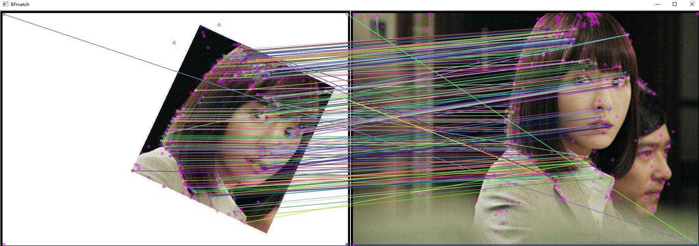

RCNN 논문리뷰
===


Rich feature hierarchies for accurate object detection and semantic segmentation Tech report (v5)


abstract
---
객체 감지 성능에 있어, `PASCAL VOC`데이터 세트를 활용해 측정한 성능은 몇년간 정체상태였으며, 가장 성능이 좋은 방법은 여러 하위 이미지 feature와 상위레벨의 context를 결합하는 앙상블 시스템을 구성하는 것이다.   
본 논문은 mean average precision(mAP) 측정 지표에 있어 VOC 2012 결과값 대비 30%이상 개선된(mAP가 53.3%로 측정됨) 탐지 알고리즘을 제안한다.   
논문의 접근방식은 아래와 같다.   
1. obj를 segment하고 localize하기 바텀-업 방식의 제안영역에 높은 용량을 갖는 CNNs을 적용할 수 있다
2. 훈련을 위한 데이터가 라벨링이 덜 됬을 때, 사전 지도학습(supervised pre-training)을 보조작업으로 도메인별 파인튜닝을 수행해 성능 향상을 가져올 수 있다.


논문은 이 방법을 R-CNN : Regions with CNN이라 부르려 한다  
제안한 RCNN을 ILSVERC2013에서 발표된 OverFeat랑 비교해보니 성능이 더 좋앗다.
      


introduction
---

기존 시각 인식 작업(visual recognition task)는 지난 10년간 SIFT, HOG사용을 기반으로 하고 있다.
그러나, PASCAL VOC Obj detection성능을 보면 일반적으로 10~12년 동안 앙상블 시스템 구축 프로세스를 기반으로 진행되어왔고 해당 방식으로 조금씩의 진보가 이뤄지고 있었다.   

* SIFT(Scale Invariant Feature Transform)
  * 이미지에서 특징점을 추출하는 대표적 알고리즘 중 하나임.   
이미지의 Scale, Rotation에 불변하는 feature(특징)을 찾아냄.

```python
import numpy as np
import cv2
from matplot import pyplot as plt

img1 = cv2.imread('falsify_img.jpg') #변조된 이미지
img2 = cv2.imread('orign_img.jpg') #원본 이미지

sift = cv2.xfeature2d.SIFT_create()
#SIFT 추출기 생성

kp1, des1 = sift.detectAndCompute(img1, None)
#키 포인트 검출과 서술자 계산 -> 이미지 1에 대한
kp2, des2 = sift.detectAndCompute(img2, None)

bf = cv2.BFMacher(cv2.NORM_HAMMING, crossCheck=Ture)
#매칭을 위한 변수 만들고 초기화

matches = bf.match(des1, des2) #매칭 시작
matches = sorted(matches, key = lambda x:x.distance)
#매칭된 특징점들을 길이별로 정렬함

img3 = cv2.drawMatches(img1, kp1, img2, kp2, matches[:10], flags=2)
#이미지1, 이미지2의 매칭결과를 키 포인트와 함께 새로 그림을 그려서 보여줌
plt.imshow(img3)
plt.show()
```
대략 아래와 같은 그림이 그려질 것임



