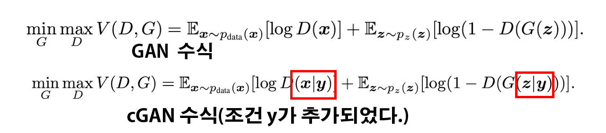
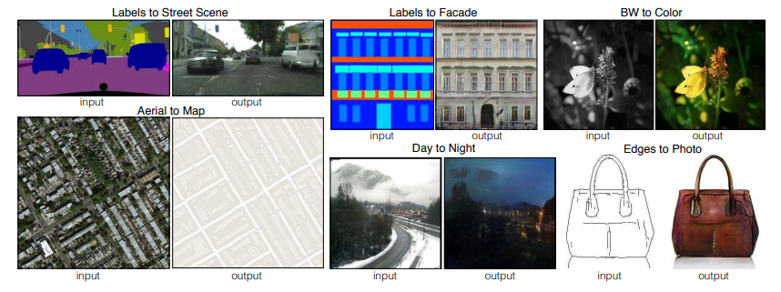
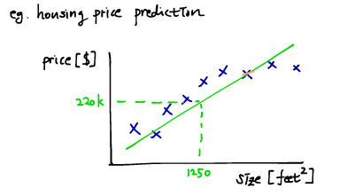
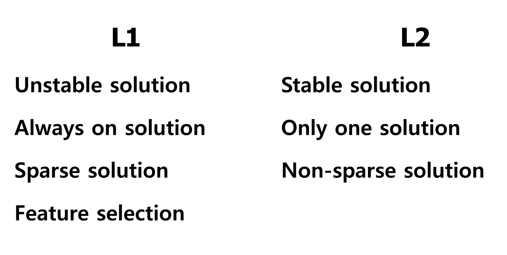
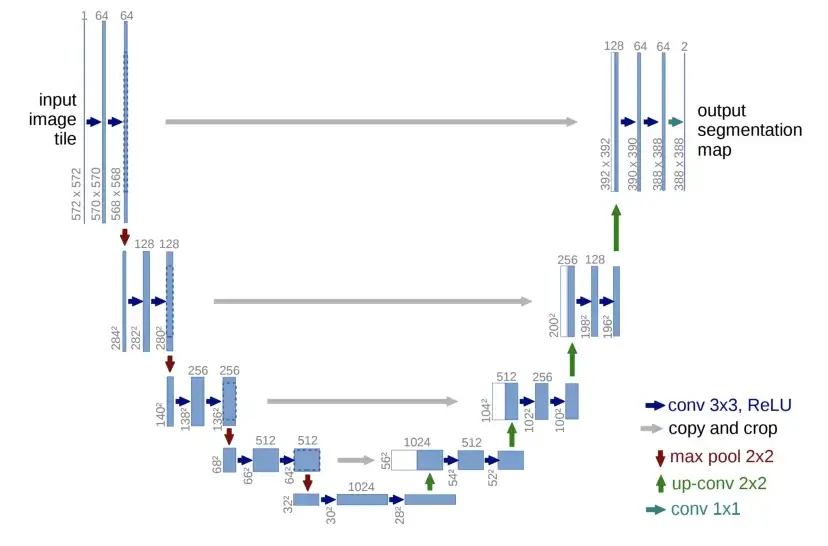
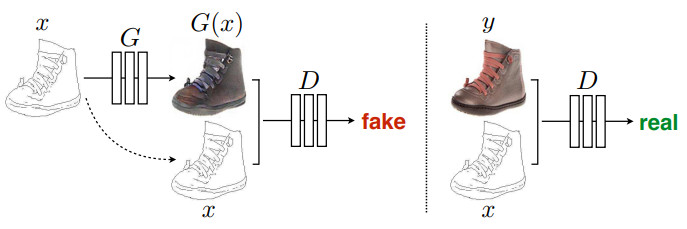
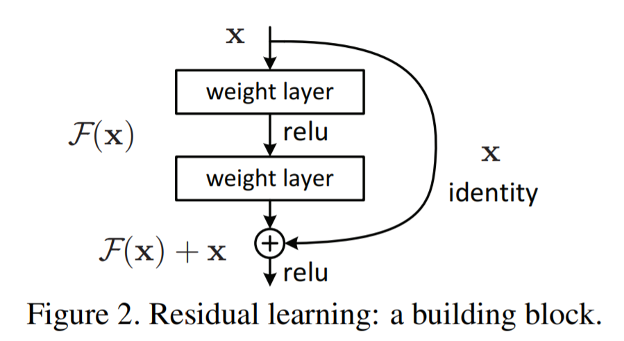

GAN기반 이미지 변환 논문 리뷰
===

## 논문제목 : Image-to_image Translation with Conditional Adversarial Networks

--------------------------


Abstract
---
논문은 이미지 대 이미지 변환 문제(image to image tranlatio problem)에 대한 범용 솔루션으로 조건부 적대적 네트워크를 조사한다(conditional adversarial network).   
+ cGAN(Conditional GAN) : 기존의 GAN은 Generator에 노이즈와 discriminator에 img만 입력하는 구조이다.   
여기서 조건부 데이터는 레이블을 갖는 노이즈와 레이블을 갖는 이미지를 말한다.   
즉, cGAN은 GAN에 `레이블`이라는 추가적인 정보를 주어서 성능을 향상시킨 모델이라 보면 된다.
+ 이해가 안대서 조금 더 쉽게 설명 : GAN(Generative Adversarial Nets)는 생성 모델을 훈련하는 방법 중 하나이며, cGAN은 Generator과 Discriminator에 모두 조건부 데이터 y를 제공해 구성한 모델이다.   
    + GAN의 장점/단점 요약 : 생성모델 훈련을 위해 GAN의 도입이 활발하게 이뤄지고 있고, GAN의 장점은 Markov chain을 전혀 필요로 하지 않으며, backpropagation만을 사용해 기울기를 얻으며, 학습중에 추론이 필요하지 않고, 다양한 요소와 상호 작용을 모델에 쉽게 통합할 수 있다는 것이다.   
    그러나 GAN은 생성되는 데이터에 대한 통제가 불가능 하다 -> 예로 MNIST로 내가 `1`을 생성하고 싶다고 해서 `1`만을 목표로 생성하는것이 안되고, 만들고자 하는 데이터 셋을 지시할 수 없다는 한계점이 있다.
+ cGAN은 생성 모델에 대한 추가 정보를 조건화 해 데이터 생성 프로세스를 조건화 하는 것이 가능하다. -> 이를 conditioning이라 부르며, class lavel 혹은 다른 양식의 data를 기반으로 한다.   
   
초록색 y정보가 추가적인 정보라 보면 된다.   
   


이 cGAN넷은 입력 이미지에서 출력이미지로의 매핑을 학습할 뿐만 아니라, 매핑을 훈련하기 위한 손실함수도 학습한다.
+ 손실함수(loss function) : 신경망에서 학습하여 얻은 예측값 y와 정답 레이블 t와의 오차를 나타낸 함수   
수식은 `y = wx + b`여기서 `w`는 가중치, `b`는 편향   
이 손실함수의 값을 최소화 하기 위해서 최적화된 `w`와 `b`를 구해야 하며, 여기서 주로 사용되는 방식이 `경사하강법(gradient descent)`임   


아무튼 cGAN을 통해 전통적으로 매우 다른 손실함수에 대한 공식이 필요한 문제에 대해서도 일반적인 접근방법을 적용할 수 있다.   
설계한 cGAN은 레이블 맵(label maps)에서 사진을 합성하고, 에지 맵(edge maps)에서 객체를 재 구성하고, 이미지를 colorizing(흑백 이미지를 컬러화) 하는데 효과적임을 보여준다.   
이 논문과 관련된 것으로 pix2pix소프트웨어가 있고, 공개되 있어서 사용자들이 수작업을 해주고 있다??


Introduction
---
이미지 처리, 컴퓨터 그래픽 및 컴퓨터 비전 분야에서 발생하는 문제는 입력 이미지를 목표에 부합하는 출력 이미지로 '변환'하는 것이다.   
이 예는 입력되는 장면(scene)을 RGB, Gradient field, edge amp, semantic label map 등으로 랜더링 할 수 있다.   
이 프로세스를 자동 언어 번역 프로세스와 유사하게 이미지의 변환 프로세스를 충분한 신경망의 traning으로 수행할 수 있다.   
그러나, 이러한 이미지의 자동 변환은 각각의 특수목적으로 설계된 신경망을 통해 처리되는 것이 일반적이다.(예로  edge map을 만들고 싶으면 딱 edge map을 만들기 위해 설계한 신경망을 써야함, 해당 신경망이 다른 RGB변환가 같은 프로세스를 수행할 수 없음)   
논문의 목표는 위 언급한 프로세스에 대한 공통 프레임워크를 개발하는 것이다.   

   
논문이 제시하는 Conditional Adversarial Net는 위 사진에서 볼 수 있는 다양한 이미지 변환(프로세스)를 수행 가능한 범용 솔루션이다.   각각의 경우에 논문에서는 동일한 아키텍쳐와 목표(objective)를 사용하고 training 시에만 다른 데이터 셋을 사용할 뿐이다.   

이같은 제안을 하는 이유로는 이미지 예측 문제(image prediction problem)에 있어서 주로 사용되는 작업 도구로 CNN이 있기에 여기서 논문의 저자가 연구 필요성을 착안함.   
논문의 저자가 요약한 CNN은 결과의 품질을 점수화 하여, 신경망의 목표를 loss function을 최소화 하는 방향으로 학습을 진행한다 요약함, 아울러 학습 프로세스는 자동이나, 효과적인 손실함수 설계에는 수작업이 필요하다 평하고 있음.   
즉, CNN은 minimize하기 위한 목표를 재대로 CNN에 알려줘야함 -> 이것을 잘 못알려 주면 결과값이 흐릿해지는 문제가 발생함   
+ 찾아본 CNN의 단점 : Pooling과정에서 정보손실, 아키텍쳐 depth가 충분하지 않으면 전체를 보고 특징 추출 불가, convolution연산에 연산량이 많이 필요함   

대신에 `출력 이미지를 현실과 구별 못하게 만들기` 같이 높은 수준의 목표만 지정하고, 이 목표를 충족하는데 적합한 손실 함수(loss function)를 자동으로 학습 할 수 있다면 매우 바람직한 상황이 될 것이다.   
이에 대한 최근에 제안된 가장 좋은 솔루션은 Generative Adversarial Network(GAN)이다.   
GAN은 출력이미지가 진짜인지 가짜인지 분류하는 손실을 학습함과 동시에 이 손실을 최소화 하기위한 생성모델을 훈련합니다.  
이때 흐릿한 이미지는 당연히 가짜로 보이기 때문에 허용되지 않는 장점이 있습니다.   
GAN은 데이터에 적응하는 손실을 학습하기에 작업별로 다른 종류의 손실함수가 적용되어야 하는 작업 군 에 대해 적용이 가능하다.   

논문에서는 조건부 설정(conditional setting)이 적용된 GAN에 대해 탐색하고자 한다. cGAN은 이미지의 조건을 기반으로 출력이미지를 생성하기에 이미지->이미지 변환작업에 적합하다.   
cGAN은 아직까지는 특정 어플리케이션에 초점이 맞춰져 있어서 범용 솔루션으로 효율이 있는지에 대해서는 불확실한 부분이 있다.  하여 논문은 cGAN이 다양한 문제에 대해 합리적인 결과를 보임을 입증하는 것이고, 이에 대한 간단한 프레임워크를 제시하는 것이다.   


Related work
---

### Structured losses for image modeling
이미지의 변환 문제는 pre-pixel classification 혹은 regression(분류 혹은 회귀)로 공식화된다.   
이같은 공식(formulation)은 각 출력픽셀이 입력 이미지가 주어진 다른 모든 픽셀과 조건부로 독립적인 것으로 간주된다는 점에서 출력공간을 `구조화 되지 않은 것`으로 취급한다.   
~~(이 부분은 잘 이해가 되지 않는다.)~~   
cGAN은 구조화된 손실을 학습한다. 이 구조화된 손실(structured loss) 출력 정보(output)의 `joint configuration(연관 관계)`에 패널티를 준다.   
이 패널티를 부과하는 방식으로는 아래의 방식이 있다.   
1. Conditional random fields
2. SSIM matric
3. feature matching
4. Nonparametric losses
5. Convolutional psudo-prior
6. Losses based on matching covariance statistics   


~~이 패널티를 부과하는 방식의 경우 찾아보니까 내용이 다 어렵다...~~

cGAN은 손실이 학습된다는 점에서 다른 점이 있으며, 이론적으로 출력과 대상 간에 다름의 정도를 발생시키는 구조에 패널티를 부과할 수 있다??


### Conditional GANs
논문 이전에도 cGAN을 적용한 사례가 있다.   
다른 논문에서 이미지-이미지 변환 문제에는 일반 GAN을 적용 후 L2 regression을 사용해 출력이 입력에 따라 조정되도록 진행했었음..   
+ L2 regression : L2 regression으로 검색하면 나오지는 않는데 Linear Regression, L2 Regulation등의 연관정보를 통해서 알아야 할거 같음
+ 첫번째로 Liner regression에 대한 설명임. (https://wikidocs.net/4213)
    + 예를 들어 집값과 평수의 상관관계에 대한 정보를 수집했다 가정하자. 이 경우 `집값 정보`라는 정답이 존재함으로 이는 `Supervised Learning`에 해당하고 추정하고자 하는 값이 실수값이기에 `Regression ploblem`이다. 이때 평수와 집값이 선형 관계에 있다 가정한다면 이는 `Linear regression`이 된다.   
       
    여기서 `Hypothesis function`함수가 등장하는데 이 함수는 input(feature)와 output(target)의 관계를 나타낸 함수이다. -> 이 관계함수 h는 최적의 관계성을 보여줄 수록 좋다 -> 여기서 최적화 문제
    이 hypothesis는 수식으로는 아래와 같이 표현된다.   

    $$h_\theta(x) = \theta_0 + \theta_1 x$$   

    위 $\theta$는 Parameter이라 하며 설계에 따라 절편, 기울기가 달라지고 -> 여기서 최적값을 찾아내야 한다.   
    이를 위한 cost function은 아래와 같다.    

    $$J(\theta_0, \theta_1) =  \frac{1}{2m} \sum_{i=1}^{m} (\widehat{y}^i - y^i)^2 = \frac{1}{2m} \sum_{i=1}^{m} (h_\theta(x^i) - y^i)^2$$

    $$error = h_\theta(x) - y$$   


    위 에러를 최소화 하는 방식에 GD(Gradient Descent)를 적용한다 보면 된다.
    + 이제 `Regularization`문제에 대해 앞서 알아야 할 Overfitting이슈에 대해 설명하고자 한다.   
    위 `cost function`의 최적화 과정에는 GD를 통해 반복적으로 파라미터를 추정해 나가는데, 이것이 너무 최적화 되어 있는 경우에는 학습 데이터가 아닌 새로운 데이터에 대하여 올바른 값을 내보내지 못하는 현상이 발생하기도 한다. -> 이를 `Overfitting`이라 한다.   
    이것을 덜 적합하게 최적화 해서 어느정도 일반성을 띄게 해주는 것을 `Regularization`이라 부른다.   
    이 `Regularization` 방식은 L1, L2로 나뉜다.   
        + L1 Regularization은 Lasso라 불리우며, cost function 뒤에 L1항을 추가해주는 것이다.   

        $$J(\theta) =  \frac{1}{2m} \sum_{i=1}^{m} (h_\theta(x^i) - y^i)^2 + \frac{\lambda}{2} \sum_{j=1}^{n}\vert \theta_j \vert$$   

        + L2 Regularization은 Ridge라고 불리우며 L2항 추가 방법은 L1과 유사하다.   

        $$J (\theta) =  \frac{1}{2m} \sum_{i=1}^{m} (h_\theta(x^i) - y^i)^2 + \frac{\lambda}{2} \sum_{j=1}^{n}\theta_j^2$$   

        + Lasso와 Ridge의 차이는 Lasso는 GD가 수행될때 일부 항의 계수가 0이 되버리는데, Ridge는 전체적인 $w_i$값의 절대값을 감소시켜 Lasso대비 더 구불구불한 GD를 수행하게 된다.   
        ~~추가항이 절대값이냐 제곱값이냐 차이인거 같은데 수학이 약해서...~~   
        아무튼 요약하면 아래의 그림처럼 L1, L2 결과를 나누어 볼 수 있다.   
           
        위 정규화에 대해 좀 더 자세하게 설명된 사이트는 https://light-tree.tistory.com/125 이니 참고할 필요성이 있다. (L1 Regularization과 L2 Regularization이 더 쉽게 설명됨.)


이전의 논문들은 inpainting, future state prediction, image manipulation, super-resolution등의 영역에서 목적에 맞춰 조정된 프레임워크를 기반으로 인상적인 결과를 달성함.   
그러나 논문이 제시하는 프레임 워크는 설계한 어플리케이션에 특정한 것이 없다는 장점이 있음(범용성이 있다는 이야기)   
또한 Generator와 Discriminator, 몇가지 아키텍쳐 선택에서 이전 작업과 차이가 있음.   
이전 논문들과 달리 Generator에 `U-Net`기반 아키텍쳐를 사용하고, Discriminator에는 이미지 패치 규모의 구조에만 패널티를 부과하는 `PatchGAN` Discriminatior을 사용함.   

 + U-Net : 처음에는 바이오 메디컬 분야에서 이미지 분할(Image Segmentation)을 목적으로 제안된 End-to-End방식의 Fully-Convolutional Network 모델이다.   
 이 모델의 경우 네트워크의 구성 형태가 `U`자 형태를 띄기에 `U-Net`라 불리고 있다.   
    
 U-Net 아키텍쳐는 위 그림처럼 표현되며, 왼쪽 부분은 Contracting Path이고, 오른쪽 부분은 Expanding Path이다
    + Contracting Path 과정 : 3x3 conv를 두 차례 반복(이때 padding없음), 활성화 함수는 ReLU, 2x2 max-pooling(stride는 2), 다운 샘플링마다 채널의 수를 2배로 늘림
    + Expanding Path 과정 : 2x2 conv 후(Up-Conv), 3x3 conv를 두 차례 반복(padding없음), Up-Conv를 통한 업 스케일링마다 채널의 수를 반으로 줄임, 활성화 함수는 ReLU, Up-Conv된 특징맵은 위 Contracting path의 테두리가 Cropped된 특징맵(Feature map)와 concatenation(연쇄) 함, 마지막 레이어에서는 1x1 conv연산
    + 위 같은 구성으로 총 23개의 레이어로 된 FCN(Fully Convolution Networks) 구조임
    + 장점으로는 입력 이미지의 크기에 제약이 별로 없다, 적은 양의 학습 데이터 만으로도 Data Augmentation(데이터셋을 늘리는 방법)가 가능하다.
+ PatchGAN : Discriminator의 종류 중 하나로 이미지 변환 분야에서가장 많이 쓰이거나 핫 한 Discriminator로 보임.(다른 Discriminator로는 PixelGAN, ImageGAN이 있는 듯 함)
    + Patch 단위가 있어서 이거로 Discriminate한다는 컨샙이라는데, 특정 크기(Patch)단위로 Generator이 생성한 이미지의 진위 여부를 판단하며, Markovian Discriminator, Local-patch Disctiminator라고도 불리기도 한다.
    + Patch size를 설계할 때, 적절한 Correlation관계가 유지될 수준으로 크기를 맞추고 그 패치들이 대부분 진짜인 방향으로 학습이 진행된다.   
    이때, Patch size가 전체 이미지 크기 및 영상 전체에 대하여, 특정 픽셀과 다른 픽셀들 간의 연관(Correlation)관계가 존재할 정도의 `적절한` 범위로 설계야 하며, 이거때문에 `Patch size`를 `Hyperparameter`라고 보는것 같다.   
    기존의 GAN Discriminator은 Generator이 만들어준 입력 데이터(이미지)를 전부 보고 Real/Fake 여부를 판단한다 -> 따라서 Generator의 생성 전략이 데이터의 일부 특징을 과장하는 쪽으로 생성하는 경향이 있다. -> 이것에 대한 문제로 이미지 퀄리티 여부를 고려하지 않기에 결과 이미지에 `blur`가 발생하는 경우가 왕왕 있다.
    + 이렇게 블러가 발생한 이미지를 Fake로 판별하는 보완 기법이 있는 것 같지만, PatchGAN으로 이러한 문제점을 해결이 가능한 것으로 보인다.
    + PatchGAN은 임의의 직경(Patch 직경)더 멀리 있는 픽셀들 끼리는 서로 독립적이다. 라는 가정으로 출발하였으며, 이를 통해 이미지를 하나의 MRF(Markov Random Field)로 모델링 할 수 있다는 것이다.   
    + 이 MRF는 무방향 확률 그래프(Undirected graph)모델로서 베이지안 모델링(Bayesian modeling)을 통해 이미지를 분석하는데 사용할 수 있다.   
    ~~여기에 더 깊은 설명이 있으나 여기까지만 적는다~~
    + 아무튼 PatchGAN을 쓰면 패치 단위의 sliding window를 만들고 이걸로 Discriminition연산을 수행하기에 `파라미터 개수`가 적어지는 장점이 있다. -> 이는 Discriminator 네트워크 크기를 줄이는 것이 가능해진다. 또한 전체 이미지 크기에도 크게 구애받지 않는 장점이 있다.

전반적으로 논문에서는 사용하는 이미지의 크기에 제약조건이 없는 `U-Net`과 `PatchGAN`을 각각 생성자와 식별자로 사용하여 범용성을 확보한 이미지 전환 작업을 수행하는 프레임워크를 만드려 하고 있다.   
논문은 256x256크기의 입력 영상과 G에서 만든 Fake 256x256이미즈를 `concatenate`하여 최종적으로 30x30x1 크기의 feature맵을 얻어낸다.   
이 feature map의 1픽셀은 입령영상에 대한 70x70사이즈의 Receptive field(수용 영역)에 해당한다.   
+ concatenate : 모델을 결합하는 앙상블 중 하나인데 행렬을 붙이는 과정에 대한 이야기이다.   
이에 대한 예제코드는 아래와 같다.   


```python
import tensorflow as tf
import numpy as np

t1 = [[1,2,3],[4,5,6]] #np.shape()하면 (2,3) 행렬임
t2 = [[7,8,9],[10,11,12]]

t3 = tf.concat([t1, t2], axis = 0)
#t3 = [[1,2,3], [4,5,6], [7,8,9], [10,11,12]]
#shape = (4,3) 행렬로 합침
t4 = tf.concat([t1, t2], axis = 1)
#t4 = [[1,2,3,7,8,9], [4,5,6,10,11,12]]
#shape (2,6) 행렬로 합침

#여기서 axis 값이 n이면 n-1차원 이후에 처음의 안쪽 차원을 붙인다는데..  
```


Method
---

일반 GAN은 랜덤 노이즈 벡터 z 에서 출력 이미지 y로의 매핑을 학습하는 생성 모델로 수식은 아래와 같다   

$$ G : z \rightarrow y$$   

이와는 대조적으로 cGAN은 인풋 이미지 x와 랜덤 노이즈 벡터 z에서 y로 아래의 수식과 같은 매핑을 학습합니다.   

$$ G : \{x, z\} \rightarrow y$$   

생성기 G는 판별기 D에 의해 진짜 이미지와 구별할 수 없는 출력을 생성하도록 훈련하고, 판별기 D도 마찬가지로 훈련을 진행합니다.   
   
cGAN의 설명 그림, 일반 GAN과는 다르게 G, D모두 edge map인 x를 observe한다(이 x가 조건부 라벨정보 인듯)


### Objective
cGAN는 아래와 같이 수식화가 가능하다.   

$$ \mathcal{L}_{cGAN}(G, D) = \mathbb{E}_{x,y}[\log D(x, y)] + \mathbb{E}_{x,y}[\log (1-D(x, G(x,z)))]$$   

여기서 G는 ojbective를 최대화 하려는 D에 맞서 objective를 최소화 하려 한다.   
이 G와 D의 지향점을 아래의 수식으로 표현이 가능하다.   

$$ G^{*} = arg\min_{G}\max_{D}\mathcal{L}_{cGAN}(G, D)$$   

논문에서는 cGAN의 conditioning과정을 중요하게 어필하기 위해 일반 GAN과의 비교분석도 수행하는 듯 하다.   

$$ \mathcal{L}_{cGAN}(G, D) = \mathbb{E}_{y}[\log D(x, y)] + \mathbb{E}_{x,y}[\log (1-D(x, G(x,z)))]$$   

이전 논문들에서의 GAN접근 방식은 GAN의 objective를 L2 distance와 같은 전통적인 손실과 mix하는 것이 유익하다 이야기 하고있음.   
Discriminator의 작업은 변경되지 않으나, Generator는 Discriminator을 속여야 하고 이는 L2으 ㅣ관점에서 본다면 GT(Ground Truth)와 가까워져야 한다. 또한 L1이 덜 흐려지는것(블러가 끼지 않는것)을 권장하기에 L2가 아닌 L1 distance를 사용해 이 옵션을 탐색하는것이 좋다.   
~~ 잘 이해가 안됨..~~   

$$\mathcal{L}_{L1}(G) = \mathbb{E}_{x,y,z}[\parallel y-G(x,z) \parallel _1]$$   

하여 위 수식의 GAN이 목표하는 바 를 수식화 하면 아래와 같다.   

$$ G^{*} = arg\min_{G}\max_{D}\mathcal{L}_{cGAN}(G, D) + \lambda \mathcal{L}_{L1}(G)$$   

z가 없으면 x에서 y로의 매핑은 학습 가능하나 결정론적 출력(deterministic outputs)을 생성하기에 delta function의 distribution(분포)와 일치하지 않는 문제가 있다. -> 이에 대해 cGAN은 해결 방식으로 생성기에 대한 입력으로 x와 더불어 가우시안 노이즈 z를 함께 넣어준다.   
논문에서는 이 방식을 채택하지 않고 노이즈를 무시하는 방법을 적용함.   
그 대신에 최종 모델의 경우 train 및 test시간에 생성기의 여러 레이어에 적용되는 dropout형태의 노이즈를 제공함   
여기부터는 잘 이해가 안됨.. 대략 논문에 적용한 cGAN의 상세 설정 내용으로 보임...


### Network architectures
논문에서 생성기 및 판별기는 41번 논문에서 채택한 생성기 및 판별기를 쓰며, 생성기와 판별기 모두 convolution-BatchNorm-ReLu형식의 모듈을 사용함   
레이어 구성 형식을 말함 -> 이거는 코드 보면 이해가 빠를듯   

#### Generator with skips
이미지 변환기 작성의 주요한 문제는 고해상도 입력 -> 그대로 고해상도 출력으로 매핑 이다.   
다른 논문들은 이 문제를 해결하기 위해 인코더-디코더 네트워크를 사용했었다.   
그러나 다운샘플링 및 병목 현상이 발생하는 문제가 있다.   
논문은 정보의 병목 현상(bottleneck)를 우회하기 위해 U-Net에 skip connection을 추가했다.
+ Skip connection : 딥러닝 아키텍쳐에서 설계된 레이어가 있을 때 몇개 레이어를 건너뛰는 기법   
   
이렇게 레이어를 건너 뛰는 이유는 깊이가 너무 깊은 레이어를 설계하면 때에 따라서는 성능이 하락하는 결과가 발생하기 때문 -> 이거를 vanishing/exploding gradient problem라 부르는 듯   
아무튼 사용하는 네트워크의 일부를 건너 뛰어서 레이어를 줄이는걸 말하는건데 이게 코드 단계에서 어떤 비효율성을 해소하는지는 잘 이해가 안됨. 그러니까 죽는 레이어가 발생하는데 이걸 어케 핸들링 한다는건지...

#### Markovian discriminator (PatchGAN)
L2 loss와 L1 loss에서 이미지 생성 시 흐릿한 결과가 나오는 것이 왕왕 있다.   
이때 고 주파수 선명도(high frequency crispness) 는 높이지 못하나 저 주파수 영역은 정확하게 캡쳐한다.
(약간 이해가 안되나, 이미지에 있어 경계(edge)선 영역은 고 주파수 영역이라 보임)   
아무튼 L1 항 추가로 저주파 정확성은 보장이 되니 고주파 정확성을 확보하기 위해서 PatchGAN 판별기 아키텍쳐를 도입함


### Optimization and inference
네트워크의 최적화에는 표준 접근 방식을 따른다. (gradient descent 방식을 수행하여 최적화 한다는 말)   
이거 GD과정은 D-> G -> D -> G 이런식인듯, 이거 전체적으로는 SGD(stochastic gradient descent)임   
학습이 완료된 후 추론을 하는데 학습 방식과 같은 방식으로 생성기 네트워크를 실행함.  batch size는 실험에 따라 1~10으로 사용함