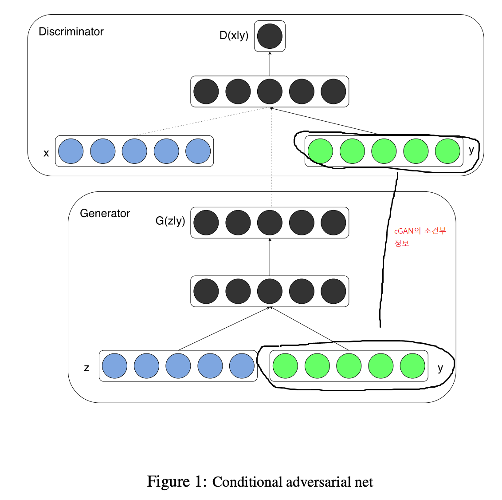

GAN기반 이미지 변환 논문 리뷰
===

## 논문제목 : Image-to_image Translation with Conditional Adversarial Networks

--------------------------

Abstract
---
논문은 이미지 대 이미지 변환 문제(image to image tranlatio problem)에 대한 범용 솔루션으로 조건부 적대적 네트워크를 조사한다(conditional adversarial network).   
+ cGAN(Conditional GAN) : 기존의 GAN은 Generator에 노이즈와 discriminator에 img만 입력하는 구조이다.   
여기서 조건부 데이터는 레이블을 갖는 노이즈와 레이블을 갖는 이미지를 말한다.   
즉, cGAN은 GAN에 `레이블`이라는 추가적인 정보를 주어서 성능을 향상시킨 모델이라 보면 된다.
+ 이해가 안대서 조금 더 쉽게 설명 : GAN(Generative Adversarial Nets)는 생성 모델을 훈련하는 방법 중 하나이며, cGAN은 Generator과 Discriminator에 모두 조건부 데이터 y를 제공해 구성한 모델이다.   
    + GAN의 장점/단점 요약 : 생성모델 훈련을 위해 GAN의 도입이 활발하게 이뤄지고 있고, GAN의 장점은 Markov chain을 전혀 필요로 하지 않으며, backpropagation만을 사용해 기울기를 얻으며, 학습중에 추론이 필요하지 않고, 다양한 요소와 상호 작용을 모델에 쉽게 통합할 수 있다는 것이다.   
    그러나 GAN은 생성되는 데이터에 대한 통제가 불가능 하다 -> 예로 MNIST로 내가 `1`을 생성하고 싶다고 해서 `1`만을 목표로 생성하는것이 안되고, 만들고자 하는 데이터 셋을 지시할 수 없다는 한계점이 있다.
+ cGAN은 생성 모델에 대한 추가 정보를 조건화 해 데이터 생성 프로세스를 조건화 하는 것이 가능하다. -> 이를 conditioning이라 부르며, class lavel 혹은 다른 양식의 data를 기반으로 한다.   
   
초록색 y정보가 추가적인 정보라 보면 된다.   
   

이 cGAN넷은 입력 이미지에서 출력이미지로의 매핑을 학습할 뿐만 아니라, 매핑을 훈련하기 위한 손실함수도 학습한다.
+ 손실함수(loss function) : 신경망에서 학습하여 얻은 예측값 y와 정답 레이블 t와의 오차를 나타낸 함수   
수식은 `y = wx + b`여기서 `w`는 가중치, `b`는 편향   
이 손실함수의 값을 최소화 하기 위해서 최적화된 `w`와 `b`를 구해야 하며, 여기서 주로 사용되는 방식이 `경사하강법(gradient descent)`임   

아무튼 cGAN을 통해 전통적으로 매우 다른 손실함수에 대한 공식이 필요한 문제에 대해서도 일반적인 접근방법을 적용할 수 있다.   
설계한 cGAN은 레이블 맵(label maps)에서 사진을 합성하고, 에지 맵(edge maps)에서 객체를 재 구성하고, 이미지를 colorizing(흑백 이미지를 컬러화) 하는데 효과적임을 보여준다.   
이 논문과 관련된 것으로 pix2pix소프트웨어가 있고, 공개되 있어서 사용자들이 수작업을 해주고 있다??

Introduction
---
이미지 처리, 컴퓨터 그래픽 및 컴퓨터 비전 분야에서 발생하는 문제는 입력 이미지를 목표에 부합하는 출력 이미지로 '변환'하는 것이다.   
이 예는 입력되는 장면(scene)을 RGB, Gradient field, edge amp, semantic label map 등으로 랜더링 할 수 있다.   
이 프로세스를 자동 언어 번역 프로세스와 유사하게 이미지의 변환 프로세스를 충분한 신경망의 traning으로 수행할 수 있다.   
그러나, 이러한 이미지의 자동 변환은 각각의 특수목적으로 설계된 신경망을 통해 처리되는 것이 일반적이다.(예로  edge map을 만들고 싶으면 딱 edge map을 만들기 위해 설계한 신경망을 써야함, 해당 신경망이 다른 RGB변환가 같은 프로세스를 수행할 수 없음)   
논문의 목표는 위 언급한 프로세스에 대한 공통 프레임워크를 개발하는 것이다.   

   
논문이 제시하는 Conditional Adversarial Net는 위 사진에서 볼 수 있는 다양한 이미지 변환(프로세스)를 수행 가능한 범용 솔루션이다.   각각의 경우에 논문에서는 동일한 아키텍쳐와 목표(objective)를 사용하고 training 시에만 다른 데이터 셋을 사용할 뿐이다.   

이같은 제안을 하는 이유로는 이미지 예측 문제(image prediction problem)에 있어서 주로 사용되는 작업 도구로 CNN이 있기에 여기서 논문의 저자가 연구 필요성을 착안함.   
논문의 저자가 요약한 CNN은 결과의 품질을 점수화 하여, 신경망의 목표를 loss function을 최소화 하는 방향으로 학습을 진행한다 요약함, 아울러 학습 프로세스는 자동이나, 효과적인 손실함수 설계에는 수작업이 필요하다 평하고 있음.   
즉, CNN은 minimize하기 위한 목표를 재대로 CNN에 알려줘야함 -> 이것을 잘 못알려 주면 결과값이 흐릿해지는 문제가 발생함   
+ 찾아본 CNN의 단점 : Pooling과정에서 정보손실, 아키텍쳐 depth가 충분하지 않으면 전체를 보고 특징 추출 불가, convolution연산에 연산량이 많이 필요함   

