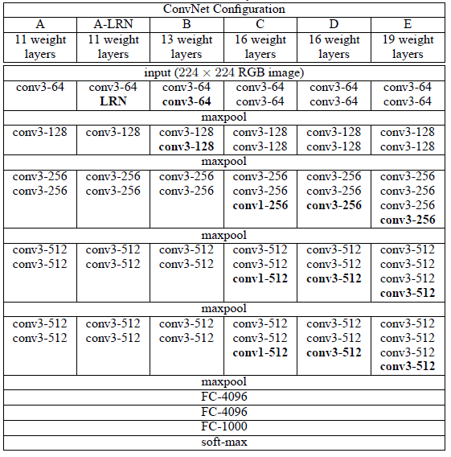
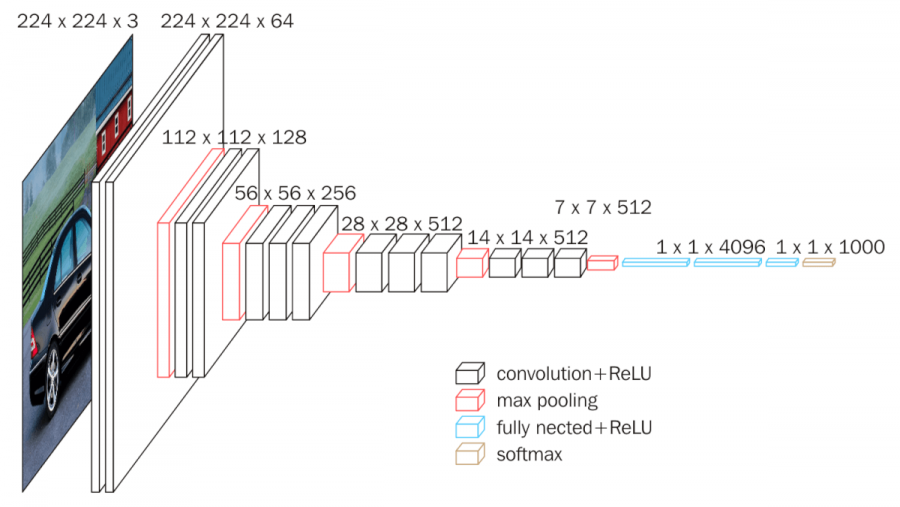

Fast R-CNN
===

Abstract
---
논문에서는 객체 검출(object detection)을 위한 방법으로 `Fast region-based Convolution Network`를 제안한다.  
Fast R-CNN은 이전의 Conv 네트워크를 기반으로 객체 분류작업을 효율적으로 하기 위해 만들어졌다.   
이전의 네트워크와 비교하여 fast R-CNN은 몇가지 혁신적인 기법을 사용하여 트레이닝과 테스트 속도, 객체 감지 정확도를 높였다.   
Fast R-CNN은 VGG16네트워크를 일반 R-CNN보다 9배 빠르게 트레이닝이 가능하고, 테스트 시간을 213배 빠르게 달성했으며, PASCAL VOC 2012대회에서 더 높은 mAP를 달성했다.   
SPPnet 대비 Fast R-CNN은 VGG16을 3배 더 빠르게 트레이닝 하고, 테스트 시간이 10배 더 빠르고 정확했다.   
Fast R-CNN은 파이썬, C++(Caffe)로 구현되어 있고, 코드는 https://github.com/rbgirshick/fast-rcnn 여기에 업로드했다.   

Introduction
---
최근 Deep ConvNet는 이미지 분류(classification)과 객체 감지 분야에서 정확성이 크게 향상되고 있다. 이미지 분류와 객체 감지를 비교하면 객체 감지가 좀 더 어려운 작업이며, 이를 해결하기 위해 현재는 multi-stage pipline으로 구성된 train model을 설계해 이를 학습시켜 사용하고 있다.   
Obj detection에는 물체에 대한 정확한 Localization이 필요하며, 이를 수행하기 위한 두가지 주요한 도전과제가 있다 -> 이로 인하여 복잡성이 증대된다.   
첫번째는 수많은 객체의 후보 위치를 처리해야 한다. 다음으로 두번째는 이러한 후보 위치중에서 정확한 Localization을 달성하기 위한 기법이다.  
위 문제를 해결하기 위한 솔루션은 종종 속도, 정확성, 단순성(Speed, Accuracy, Simplicity)가 희생되는 결과를 초래하기도 한다.   
이 논문에서는 첨단 Conv-Net기반의 객체 기반 감지기를 제안하며, 해당 감지기는 training process(훈련 프로세스)를 streamline(간소화)한 장점이 있다.   
논문이 제안한 방식은 single-stage traning algorithm으로 객체 분류와 공간 위치를 세분화 하는 방법을 공동으로 학습한다.   
제안한 방법은 일반 R-CNN대비 9배 빠르고 SPPnet보다 3배 빠르게 VGG16을 트레이닝 할 수 있습니다. 런타임 탐지 네트워크는 66%의 mAP를 달성했으며(R-CNN은 62%), 평균 0.3초당 이미지를 처리합니다.

+ VGGNet : CNN알고리즘 중 이미지 분류용 알고리즘에 속함(LeNet-5, AlexNet, VGG-F, ResNet, SENet등이 존재)   
VGGNet는 옥스포드 대학 연구팀에서 개발한 모델로 2014년 이미지넷 이미지 인식대회에서 준우승한 모델이다. 모델은 총 A, A-LRN, B, C, D, E의 하위 파생 모델이 있으며, 이 중 D 형 VGGNet가 VGG16이라고도 불리며, 총 16개의 레이어로 구성되어 있다.   
   
VGGNet의 구조 설명 표(이 중 D형 VGG16과 E형 VGG19가 가장 유명한 듯 하다)   
   
VGG16 구조

# VGG16을 pytorch로 네트워크 모델까지 직접 만들어 보자!
