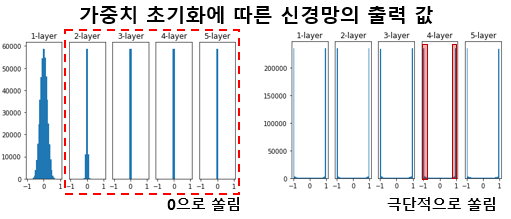

<head>
  <style>
    table.dataframe {
      white-space: normal;
      width: 100%;
      height: 240px;
      display: block;
      overflow: auto;
      font-family: Arial, sans-serif;
      font-size: 0.9rem;
      line-height: 20px;
      text-align: center;
      border: 0px !important;
    }

    table.dataframe th {
      text-align: center;
      font-weight: bold;
      padding: 8px;
    }

    table.dataframe td {
      text-align: center;
      padding: 8px;
    }

    table.dataframe tr:hover {
      background: #b8d1f3; 
    }

    .output_prompt {
      overflow: auto;
      font-size: 0.9rem;
      line-height: 1.45;
      border-radius: 0.3rem;
      -webkit-overflow-scrolling: touch;
      padding: 0.8rem;
      margin-top: 0;
      margin-bottom: 15px;
      font: 1rem Consolas, "Liberation Mono", Menlo, Courier, monospace;
      color: $code-text-color;
      border: solid 1px $border-color;
      border-radius: 0.3rem;
      word-break: normal;
      white-space: pre;
    }

  .dataframe tbody tr th:only-of-type {
      vertical-align: middle;
  }

  .dataframe tbody tr th {
      vertical-align: top;
  }

  .dataframe thead th {
      text-align: center !important;
      padding: 8px;
  }

  .page__content p {
      margin: 0 0 0px !important;
  }

  .page__content p > strong {
    font-size: 0.8rem !important;
  }

  </style>
</head>


### 4주차 코드리뷰 - Generator 및 Discriminator 설계하기


```python
#처음 시작부터 다시 하자- 까먹어서
from psutil import virtual_memory
import torch

# colab-GPU 사용 확인
gpu_info = !nvidia-smi
gpu_info = '\n'.join(gpu_info)

if gpu_info.find('falied') >= 0:
    print("GPU연결 실패")
else:
    #print(gpu_info)
    print("GPU구동 성공")

# RAM 사용량 체크
ram_gb = virtual_memory().total / 1e9
print('{:.1f} gigabytes of available RAM\n'.format(ram_gb))

# pytorch-GPU 연결 확인
device = torch.device("cuda" if torch.cuda.is_available() else "cpu")
print('학습을 진행하는 기기:',device)
```

<pre>
GPU구동 성공
68.6 gigabytes of available RAM

학습을 진행하는 기기: cuda
</pre>

```python
from fastai.data.external import untar_data, URLs
import glob

coco_path = untar_data(URLs.COCO_SAMPLE)
paths = glob.glob(str(coco_path) + "/train_sample/*.jpg")
#fastai 라이브러리에서 학습데이터 받아서 해당 경로를 리스트로 변환 후 저장

import numpy as np
import time

np.random.seed(seed = int(time.time())) #시간으로 시드 입력
chosen_paths = np.random.choice(paths, 20000, replace=False)
index = np.random.permutation(20000) #이미지 인덱스 랜덤으로 섞기
#이미지를 선택해서 불러옴

train_path = chosen_paths[index[:15000]] #0~15000 장을 훈련 데이터로 사용
val_paths = chosen_paths[index[15000:]] #15001~마지막 까지는 검증데이터로 사용
```


```python
import matplotlib
import matplotlib.pyplot as plt

#sample = matplotlib.image.imread(train_path[5])
#plt.imshow(sample)
#plt.axis("off")
#plt.show()
#이거는 어차피 샘플 데이터 프린트 하는거니까 주석처리
```


```python
from torch.utils.data import Dataset, DataLoader
from torchvision import transforms

from PIL import Image   #PIL 라이브러리는 Opencv와 동일한 기능이나, FastAi가 PIL예제가 많다
from skimage.color import rgb2lab, lab2rgb  #논문에서 RGB -> Lab 수행
import numpy as np
```


```python
class ColorizationDataset(Dataset) : #논문의 이미지 전처리 클래스
    def __init__(self, paths, mode='train'):
        self.mode = mode
        self.paths = paths

        if mode == 'train': #256x256리사이즈, 이미지 인터폴레이션 BICUBIC, 어그멘테이션 수행
            self.transforms = transforms.Compose([
                transforms.Resize((256, 256), Image.BICUBIC),
                transforms.RandomHorizontalFlip()
            ])
        elif mode == 'val': #256x256리사이즈, 이미지 인터폴레이션 BICUBIC
            self.transforms = transforms.Resize((256,256), Image.BICUBIC)
        else:
            raise Exception("모드입력 에러")


    def __getitem__(self, index): #이미지 불러오고 RGB -> Lab수행, 텐서형식 변환
        img = Image.open(self.paths[index]).convert("RGB")
        img = np.array(self.transforms(img))
        img = rgb2lab(img).astype("float32")
        img = transforms.ToTensor()(img)

        #노멀라이제이션 수행
        L = img[[0], ...]
        ab = img[[1,2], ...]
        L = L / 50. -1
        ab = ab / 110.

        return {'L':L, 'ab':ab}
        
    
    def __len__(self):
        return len(self.paths)
```


```python
#훈련데이터와 검증데이터를 DataLoader에 넣기 위해 설계한 ColrizationDataset 전처리 클래스를 활용
dataset_train = ColorizationDataset(train_path, mode='train')
dataset_val = ColorizationDataset(val_paths, mode='val')
```

<pre>
C:\Users\HILS_AMD\AppData\Local\Temp\ipykernel_16560\4148482005.py:8: DeprecationWarning: BICUBIC is deprecated and will be removed in Pillow 10 (2023-07-01). Use Resampling.BICUBIC instead.
  transforms.Resize((256, 256), Image.BICUBIC),
c:\Users\HILS_AMD\AppData\Local\Programs\Python\Python310\lib\site-packages\torchvision\transforms\transforms.py:329: UserWarning: Argument 'interpolation' of type int is deprecated since 0.13 and will be removed in 0.15. Please use InterpolationMode enum.
  warnings.warn(
C:\Users\HILS_AMD\AppData\Local\Temp\ipykernel_16560\4148482005.py:12: DeprecationWarning: BICUBIC is deprecated and will be removed in Pillow 10 (2023-07-01). Use Resampling.BICUBIC instead.
  self.transforms = transforms.Resize((256,256), Image.BICUBIC)
</pre>

```python
dataloader_train = DataLoader(dataset_train, batch_size = 16, num_workers=0, pin_memory=True)
dataloader_val = DataLoader(dataset_val, batch_size = 16, num_workers=0, pin_memory=True)

#Dataloader에 입력한 훈련,검증데이터의 구조를 출력해보자
data = next(iter(dataloader_train))
Ls, abs = data['L'], data['ab']
print(Ls.shape, abs.shape)
#출력 결과는 [batch_size, Channel개수, tr리사이즈 크기(256,256)]이 나올것이다.
```

<pre>
torch.Size([16, 1, 256, 256]) torch.Size([16, 2, 256, 256])
</pre>
#### PyTorch로 코드 구현에 있어 알아둬야할 기본상식   


`nn.Module` : 모든 Pytorch의 nn라이브러리는 `Neural Network`의 모든 것을 포괄하는 모든 신경망 모델의 가장 기본적인 클래스이다.   

-> 즉 모든 신경망 모델은 `nn.Module`의 서브 클래스라 볼 수 있다.

이 서브클레스(설계하고자 하는 신경망)이 재대로 사용되려면 두개의 메서드를 `override`해야한다.   

1. __init__(self) : 신경망의 각 층별 정의 및 초기화

2. forward(self, x) : 위 생성자 메서드에서 구성한 레이어들의 연결관계를 설명하는 메서드    

   


`nn.Sequential` : 레이어를 설계할 시 레이어 내 모듈의 순서를 정할 수 있는 컨테이너로써, `forward()` 메서드에서 구현될 순전파를 좀더 가독성 좋게 `__init__` 메서드에서 사전에 정의를 할 수 있다.   

쉽게 말해서 `nn.Sequential`을 사용하지 않고 네트워크 레이어를 설계하면,    

네트워크 구조를 이해하는데 `__init__` 갔다가 `forward()` 갔다가 눈이 팽팽 돌게 될 것이다.


```python
#이제 Pix2Pix_Generator과 Pix2Pix_Discriminator설계를 수행한다.
import torch.nn as nn

#U-Net 구조의 Pix2Pix_Generator
class Pix2Pix_Generator(nn.Module):
    def __init__(self):
        super(Pix2Pix_Generator, self).__init__()
        #팁으로 다른 코드들 찾아보면 generator을 G_net라 기재하는 경우가 많다.
        
        #신경망 레이어는 되도록이면 nn.Sequential 컨테이너를 써서 설계하자(이래야 가독성이 좋다)
        self.input_layer = nn.Sequential(
            nn.Conv2d(1, 64, kernel_size=4, stride=2, padding=1, bias=False),
            #in_channels은 논문 읽으면 나온다 -> L채널 받아서 ab출력
            #사용한 U-Net 논문주소 : https://arxiv.org/pdf/1505.04597.pdf
            #참고로 매개변수 중 bias는 그다지 영향을 주지는 않는다...
            #논문의 appendix는 U-Net의 encoder, decoder에 대한 레이어 참고정보가 수록되어 있다.
            #Encoder : C64-C128-C256-C512-C512-C512-C512-C512
            #Decoder : CD512-CD512-CD512-C512-C256-C128-C64
        )

        self.encoder_1 = nn.Sequential(
            nn.LeakyReLU(0.2, True),
            nn.Conv2d(64, 128, kernel_size=4, stride=2, padding=1, bias=False),
            nn.BatchNorm2d(128)
        )

        self.encoder_2 = nn.Sequential(
            nn.LeakyReLU(0.2, True),
            nn.Conv2d(128, 256, kernel_size=4, stride=2, padding=1, bias=False),
            nn.BatchNorm2d(256)
        )

        self.encoder_3 = nn.Sequential(
            nn.LeakyReLU(0.2, True),
            nn.Conv2d(256, 512, kernel_size=4, stride=2, padding=1, bias=False),
            nn.BatchNorm2d(512)
        )

        self.encoder_4 = nn.Sequential(
            nn.LeakyReLU(0.2, True),
            nn.Conv2d(512, 512, kernel_size=4, stride=2, padding=1, bias=False),
            nn.BatchNorm2d(512)
        )

        self.encoder_5 = nn.Sequential(
            nn.LeakyReLU(0.2, True),
            nn.Conv2d(512, 512, kernel_size=4, stride=2, padding=1, bias=False),
            nn.BatchNorm2d(512)
        )

        self.encoder_6 = nn.Sequential(
            nn.LeakyReLU(0.2, True),
            nn.Conv2d(512, 512, kernel_size=4, stride=2, padding=1, bias=False),
            nn.BatchNorm2d(512)
        )

        self.middle = nn.Sequential(
            nn.LeakyReLU(0.2, True),
            nn.Conv2d(512, 512, kernel_size=4, stride=2, padding=1, bias=False),
            nn.ReLU(True),
            # inplace=True로 설정할 경우, 입력을 따로 저장하지 않고 바로 operation을
            # 진행하기 때문에 메모리를 소량 절약할 수 있다. 대신 원본 입력이 destroy되는
            # 점을 주의해서 사용해야 한다. -> 이래서 기본설정은 False
            nn.ConvTranspose2d(512, 512, kernel_size=4, stride=2, padding=1, bias=False),
            # Conv2d 연산으로 채널은 늘었으나 이미지 크기가 작아졌으니
            # 이를 늘리는 작업을 해야 하는데(U-net 구조니까)
            # 이방법은 nn.conv2d와 이미지를 비교해보면 아주 쉽게 이해될것이다.
            nn.BatchNorm2d(512)
        )
```
### Conv2d 함수 구동 방식   
   

### ConvTranspose2d 함수 구동방식   


```python
        self.decoder_6 = nn.Sequential(
            nn.ReLU(True),
            nn.ConvTranspose2d(1024, 512, kernel_size = 4, stride = 2, padding = 1, bias = False),
            # U-net아기텍쳐에 존재하는 skip connection으로 in_channel이 2배로 된다.
            nn.BatchNorm2d(512),
            nn.Dropout(0.5) #probability of an element to be zeroed. Default: 0.5
            # dropout은 신경망의 일반화 성능을 높이기 위해 자주 쓰이는 테크닉 중 하나이다.
            # 신경망 구조 학습시, 레이어간 연결 중 일부를 랜덤하게 삭제하면,
            # 여러개의 네트워크를 앙상블 하는 효과를 낼 수 있고,
            # 이로 인해 일반화 성능이 높아진다고 한다.
            # 말이 어려운데 전체 구성된 신경망의 연결을 랜덤으로 끊는것을 의미함
            # 이것을 수행하면 오버피팅을 좀 방지할 수 있다
        )

        self.decoder_5 = nn.Sequential(
            nn.ReLU(True),
            nn.ConvTranspose2d(1024, 512, kernel_size = 4, stride = 2, padding = 1, bias = False),
            # decoder의 skip connection으로 인한 in_channel인자값 결정은
            # 같은 층위 encoder레이어의 최종 출력 channel + 이전 decoder 레이어 출력 channel.
            # 쉽게 말해 decoder_5(in_channel) 값은
            # encoder_5(batchnorm2d(num_feature)) + decoder_6(batchnorm2d(num_feature))이다.
            nn.BatchNorm2d(512),
            nn.Dropout(0.5)
        )
```
### Dorpout함수 구동방식


```python
        self.decoder_4 = nn.Sequential(
            nn.ReLU(True),
            nn.ConvTranspose2d(1024, 512, kernel_size = 4, stride = 2, padding = 1, bias = False),
            nn.BatchNorm2d(512),
            nn.Dropout(0.5)
        )

        self.decoder_3 = nn.Sequential(
            nn.ReLU(True),
            nn.ConvTranspose2d(1024, 256, kernel_size = 4, stride = 2, padding = 1, bias = False),
            nn.BatchNorm2d(256),
            nn.Dropout(0.5)
        )

        self.decoder_2 = nn.Sequential(
            nn.ReLU(True),
            nn.ConvTranspose2d(512, 128, kernel_size = 4, stride = 2, padding = 1, bias = False),
            nn.BatchNorm2d(128),
            nn.Dropout(0.5)
        )

        self.decoder_1 = nn.Sequential(
            nn.ReLU(True),
            nn.ConvTranspose2d(256, 64, kernel_size = 4, stride = 2, padding = 1, bias = False),
            nn.BatchNorm2d(64),
            nn.Dropout(0.5)
        )

        # 입력 레이어 : L채널 -> 출력 레이어 : ab채널
        self.output_layer = nn.Sequential(
            nn.ReLU(True),
            nn.ConvTranspose2d(64, 2, kernel_size=4, stride=2, padding=1),
            nn.Tanh() # Hyperbolic Tangent
            # Tanh 함수는 함수값을 [-1, 1]로 제한시킴 -> 논문에서 함
        )

    def forward(self, x):
        input_layer = self.input_layer(x)
        encoder_1 = self.encoder_1(input_layer)
        encoder_2 = self.encoder_2(encoder_1)
        encoder_3 = self.encoder_3(encoder_2)
        encoder_4 = self.encoder_4(encoder_3)
        encoder_5 = self.encoder_5(encoder_4)
        encoder_6 = self.encoder_6(encoder_5)

        middle = self.middle(encoder_6)

        #skip connection 화살표 두개 합치는거니까 torch.cat 함수 사용함
        cat_6 = torch.cat((middle, encoder_6), dim=1)
        decoder_6 = self.decoder_6(cat_6)

        cat_5 = torch.cat((decoder_6, encoder_5), dim=1)
        decoder_5 = self.decoder_5(cat_5)

        cat_4 = torch.cat((decoder_5, encoder_4), dim=1)
        decoder_4 = self.decoder_4(cat_4)

        cat_3 = torch.cat((decoder_4, encoder_3), dim=1)
        decoder_3 = self.decoder_3(cat_3)

        cat_2 = torch.cat((decoder_3, encoder_2), dim=1)
        decoder_2 = self.decoder_2(cat_2)

        cat_1 = torch.cat((decoder_2, encoder_1), dim=1)
        decoder_1 = self.decoder_1(cat_1)

        output = self.output_layer(decoder_1)
        
        return output

```


```python
Pix2Pix_Generator()
```
   
사용한 u-net 아키텍쳐

<pre>
Pix2Pix_Generator(
  (input_layer): Sequential(
    (0): Conv2d(1, 64, kernel_size=(4, 4), stride=(2, 2), padding=(1, 1), bias=False)
  )
  (encoder_1): Sequential(
    (0): LeakyReLU(negative_slope=0.2, inplace=True)
    (1): Conv2d(64, 128, kernel_size=(4, 4), stride=(2, 2), padding=(1, 1), bias=False)
    (2): BatchNorm2d(128, eps=1e-05, momentum=0.1, affine=True, track_running_stats=True)
  )
  (encoder_2): Sequential(
    (0): LeakyReLU(negative_slope=0.2, inplace=True)
    (1): Conv2d(128, 256, kernel_size=(4, 4), stride=(2, 2), padding=(1, 1), bias=False)
    (2): BatchNorm2d(256, eps=1e-05, momentum=0.1, affine=True, track_running_stats=True)
  )
  (encoder_3): Sequential(
    (0): LeakyReLU(negative_slope=0.2, inplace=True)
    (1): Conv2d(256, 512, kernel_size=(4, 4), stride=(2, 2), padding=(1, 1), bias=False)
    (2): BatchNorm2d(512, eps=1e-05, momentum=0.1, affine=True, track_running_stats=True)
  )
  (encoder_4): Sequential(
    (0): LeakyReLU(negative_slope=0.2, inplace=True)
    (1): Conv2d(512, 512, kernel_size=(4, 4), stride=(2, 2), padding=(1, 1), bias=False)
    (2): BatchNorm2d(512, eps=1e-05, momentum=0.1, affine=True, track_running_stats=True)
  )
  (encoder_5): Sequential(
    (0): LeakyReLU(negative_slope=0.2, inplace=True)
    (1): Conv2d(512, 512, kernel_size=(4, 4), stride=(2, 2), padding=(1, 1), bias=False)
    (2): BatchNorm2d(512, eps=1e-05, momentum=0.1, affine=True, track_running_stats=True)
  )
  (encoder_6): Sequential(
    (0): LeakyReLU(negative_slope=0.2, inplace=True)
    (1): Conv2d(512, 512, kernel_size=(4, 4), stride=(2, 2), padding=(1, 1), bias=False)
    (2): BatchNorm2d(512, eps=1e-05, momentum=0.1, affine=True, track_running_stats=True)
  )
  (middle): Sequential(
    (0): LeakyReLU(negative_slope=0.2, inplace=True)
    (1): Conv2d(512, 512, kernel_size=(4, 4), stride=(2, 2), padding=(1, 1), bias=False)
    (2): ReLU(inplace=True)
    (3): ConvTranspose2d(512, 512, kernel_size=(4, 4), stride=(2, 2), padding=(1, 1), bias=False)
    (4): BatchNorm2d(512, eps=1e-05, momentum=0.1, affine=True, track_running_stats=True)
  )
  (decoder_6): Sequential(
    (0): ReLU(inplace=True)
    (1): ConvTranspose2d(1024, 512, kernel_size=(4, 4), stride=(2, 2), padding=(1, 1), bias=False)
    (2): BatchNorm2d(512, eps=1e-05, momentum=0.1, affine=True, track_running_stats=True)
    (3): Dropout(p=0.5, inplace=False)
  )
  (decoder_5): Sequential(
    (0): ReLU(inplace=True)
    (1): ConvTranspose2d(1024, 512, kernel_size=(4, 4), stride=(2, 2), padding=(1, 1), bias=False)
    (2): BatchNorm2d(512, eps=1e-05, momentum=0.1, affine=True, track_running_stats=True)
    (3): Dropout(p=0.5, inplace=False)
  )
  (decoder_4): Sequential(
    (0): ReLU(inplace=True)
    (1): ConvTranspose2d(1024, 512, kernel_size=(4, 4), stride=(2, 2), padding=(1, 1), bias=False)
    (2): BatchNorm2d(512, eps=1e-05, momentum=0.1, affine=True, track_running_stats=True)
    (3): Dropout(p=0.5, inplace=False)
  )
  (decoder_3): Sequential(
    (0): ReLU(inplace=True)
    (1): ConvTranspose2d(1024, 256, kernel_size=(4, 4), stride=(2, 2), padding=(1, 1), bias=False)
    (2): BatchNorm2d(256, eps=1e-05, momentum=0.1, affine=True, track_running_stats=True)
    (3): Dropout(p=0.5, inplace=False)
  )
  (decoder_2): Sequential(
    (0): ReLU(inplace=True)
    (1): ConvTranspose2d(512, 128, kernel_size=(4, 4), stride=(2, 2), padding=(1, 1), bias=False)
    (2): BatchNorm2d(128, eps=1e-05, momentum=0.1, affine=True, track_running_stats=True)
    (3): Dropout(p=0.5, inplace=False)
  )
  (decoder_1): Sequential(
    (0): ReLU(inplace=True)
    (1): ConvTranspose2d(256, 64, kernel_size=(4, 4), stride=(2, 2), padding=(1, 1), bias=False)
    (2): BatchNorm2d(64, eps=1e-05, momentum=0.1, affine=True, track_running_stats=True)
    (3): Dropout(p=0.5, inplace=False)
  )
  (output_layer): Sequential(
    (0): ReLU(inplace=True)
    (1): ConvTranspose2d(64, 2, kernel_size=(4, 4), stride=(2, 2), padding=(1, 1))
    (2): Tanh()
  )
)
</pre>
여기서 Pix2pix 기능에 대해 다시 생각하자.   

논문의 Pix2pix는 CGAN을 활용해서 흑백 이미지를 컬러화 하는게 목적인 네트워크이다.   

그러면 진짜 이미지는 무엇이겠는가? -> 색상정보가 다 있는 이미지이다.   

그러면 CGAN이 생성하는 이미지는 무엇인가? -> 흑백에서 색상정보를 입힌 이미지다.   

이러면 Pix2pix의 Generator는 흑백정보만 있는 L채널에서 색상정보를 생성(ab채널 생성)으로 이해가능하다.   

이제 Pix2pix의 Generator가 생성한 Fake image와 Real image모두 Lab채널 모두 보유한 이미지이다.   

그러면 Pix2pix의 Discriminator은 Lab채널이 채워진 위 두 이미지를 받아서(Input)   

출력으로 진짜 or 가짜 -> True of Fake -> 1채널 만 출력하면 된다.   

이것이 Pix2pix Generator와 Discriminator의 가장 기본적인 I/O라 볼 수 있다.


```python
# Pix2Pix_Discriminator의 구조는 C64-C128-C256-C512
# 1-dimensional output -> 출력은 1채널 : 진짜인지 가짜인지만 판별하기에
# BatchNorm is not applied First C64 layer
# All leakyReLU(slope=0.2)

class Pix2Pix_Discriminator(nn.Module):
    def __init__(self):
        super(Pix2Pix_Discriminator, self).__init__()

        self.model = nn.Sequential(
            nn.Conv2d(3, 64, kernel_size=4, stride=2, padding=1, bias=False),
            #판별기(Discriminator)는 L, a, b 3개의 채널을 input으로 받는다.
            nn.LeakyReLU(0.2, True),

            nn.Conv2d(3, 64, kernel_size=4, stride=2, padding=1, bias=False),
            nn.BatchNorm2d(128),
            nn.LeakyReLU(0.2, True),

            nn.Conv2d(128, 256, kernel_size=4, stride=2, padding=1, bias=False),
            nn.BatchNorm2d(256),
            nn.LeakyReLU(0.2, True),

            nn.Conv2d(256, 512, kernel_size=4, stride=2, padding=1, bias=False),
            nn.BatchNorm2d(512),
            nn.LeakyReLU(0.2, True),

            nn.Conv2d(512, 1, kernel_size=4, stride=2, padding=1, bias=False)
            # 원래 마지막에 sigmoid 붙여서 출력을 0~1 사이로 해야하지만
            # 파일토치의 Loss Func에 BCE 수행과정에 더 좋은 sigmoid가 붙어서
            # 여기에는 안붙인다(붙이면 sigmoid가 중복되는 비효율 발생)
            # 출력은 1채널 : 진짜인지 가짜인지만 판별하기에
        )

    def forward(self, x):
        return self.model(x)
        # 앞에 Generator은 nn.Senqutial로 레이어 1층씩 컨테이너에 담았지만,
        # Discriminator은 모든 레이어 순서까지 다 1개의 컨테이너에 담아도 된다.
```


```python
Pix2Pix_Discriminator()
```

<pre>
Pix2Pix_Discriminator(
  (model): Sequential(
    (0): Conv2d(3, 64, kernel_size=(4, 4), stride=(2, 2), padding=(1, 1), bias=False)
    (1): LeakyReLU(negative_slope=0.2, inplace=True)
    (2): Conv2d(3, 64, kernel_size=(4, 4), stride=(2, 2), padding=(1, 1), bias=False)
    (3): BatchNorm2d(128, eps=1e-05, momentum=0.1, affine=True, track_running_stats=True)
    (4): LeakyReLU(negative_slope=0.2, inplace=True)
    (5): Conv2d(128, 256, kernel_size=(4, 4), stride=(2, 2), padding=(1, 1), bias=False)
    (6): BatchNorm2d(256, eps=1e-05, momentum=0.1, affine=True, track_running_stats=True)
    (7): LeakyReLU(negative_slope=0.2, inplace=True)
    (8): Conv2d(256, 512, kernel_size=(4, 4), stride=(2, 2), padding=(1, 1), bias=False)
    (9): BatchNorm2d(512, eps=1e-05, momentum=0.1, affine=True, track_running_stats=True)
    (10): LeakyReLU(negative_slope=0.2, inplace=True)
    (11): Conv2d(512, 1, kernel_size=(4, 4), stride=(2, 2), padding=(1, 1), bias=False)
  )
)
</pre>
### 생성기, 판별기 둘 다 만들었으니 `모델 초기화`를 수행한다.   

(동일한 의미로 `Network Init`, `Kernal Init`가 있다)   


최적화에서 global mininum point(GMP)를 찾기 위한 여러가지 방법 :     

hill climbing, local search, A*, ....   


모델 초기화를 하는 이유는 위 최적화 방법에서 최대한 GMP를 찾고,   

Local mininum point에 빠지는 경우를 방지하기 위해 구현한다 보면 된다.   

+ 역전파 : 최적화과정(GD, Gradient decent) 가야할 방향을 알려줌   

+ lr(Learning rate) : Gradient decent 알고리즘(GMP를 찾는 알고리즘)을 적용시킬 때,   

얼마만큼 경사각을 내려갈 것인지 정하는 부분)   
   
   
   
모델의 초기화 과정에서 초기화를 어떻게 하느냐에 따라 학습 결과가   
매우 나빠질 수 있다.


이니셜라이즈 할때 활성화함수(Activation func)와 매칭되는 활성화 방법이 각 함수별로 있는 듯   
 + ex ) ReLU 활성화 함수에는 He(kaiming) Initialization 방법이 가장 적합하고,   
tanh의 경우 Xavier Intialization 방법이 적합하다.   
BN 레이어의 경우 weight는 1, bias는 0으로 초기화하는게 일반적이다.


```python
# Pix2Pix 초기화 -> 논문 6.2절을 보기
# Gaussian distribution 사용, 평균 0, 표준편차 0.02


def ini_weight(m): #m -> Layer을 줄여쓴 연구자들끼리의 약속
    if type(m) == nn.Conv2d:
        nn.init.normal_(m.weight.data, mean=0.0, std=0.02)
        print("Conv2D model init!")
    
    elif type(m) == nn.ConvTranspose2d:
        nn.init.normal_(m.weight.data, mean=0.0, std=0.02)
        print("ConvTranspose2D model init!")
    
    elif type(m) == nn.BatchNorm2d:
        nn.init.normal_(m.weight.data, mean=1.0, std=0.02)
        # batchnorm은 1 주변에서 정규화 하는 모델
        nn.init.constant_(m.bias.data, 0.)
        # 하여 바이어스가 1인 것을 특정 val(0.) 값으로 채우는
        # init.constant 초기화 함수를 같이 사용
        print("BatchNorm2D Initialized")

def model_init(model):
    model.apply(ini_weight)
    return model
```

위 모델초기화 코드의 경우 아래의 코드처럼 클래스로 짤 수 도 있다.  
```python
class Model(nn.Module):
    def __init__(self):

  	self.apply(self._init_weights)
      def _init_weights(self, module):
          if isinstance(module, nn.Linear):
              module.weight.data.normal_(mean=0.0, std=1.0)
              if module.bias is not None:
                  module.bias.data.zero_()

          elif isinstance(module, nn.LayerNorm):
              module.bias.data.zero_()
              module.weight.data.fill_(1.0)
```

또한 비슷한 초기화 함수는 아래 코드가 있다
```python
def initialize_weights(m):
  if isinstance(m, nn.Conv2d):
      nn.init.kaiming_uniform_(m.weight.data,nonlinearity='relu')
      if m.bias is not None:
          nn.init.constant_(m.bias.data, 0)
  elif isinstance(m, nn.BatchNorm2d):
      nn.init.constant_(m.weight.data, 1)
      nn.init.constant_(m.bias.data, 0)
  elif isinstance(m, nn.Linear):
      nn.init.kaiming_uniform_(m.weight.data)
      nn.init.constant_(m.bias.data, 0)
      
model=CNN() #사전에 설계한 CNN 모델(클래스)
model.apply(initialize_weights)
```

위 두 코드에서 `isinstance(확인하고자 하는 데이터 값, 확인하고자 하는 데이터 타입)`   
이다. 이거를 `type(m) == nn.BatchNorm2d:`이렇게 쓴것이다. 